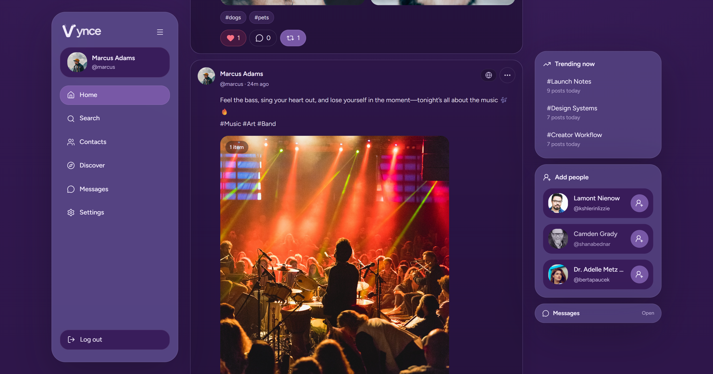
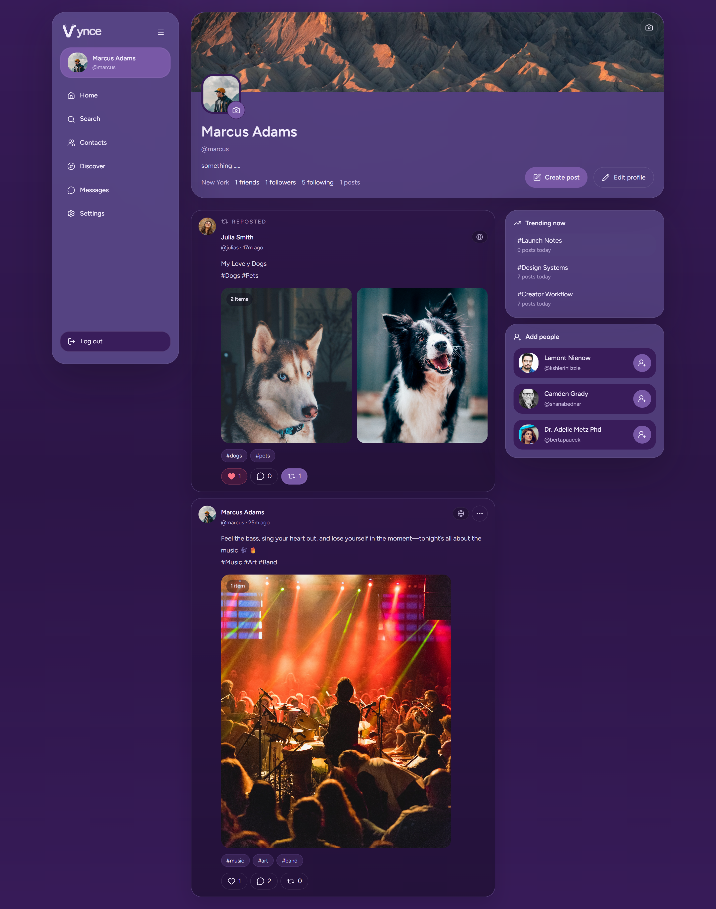
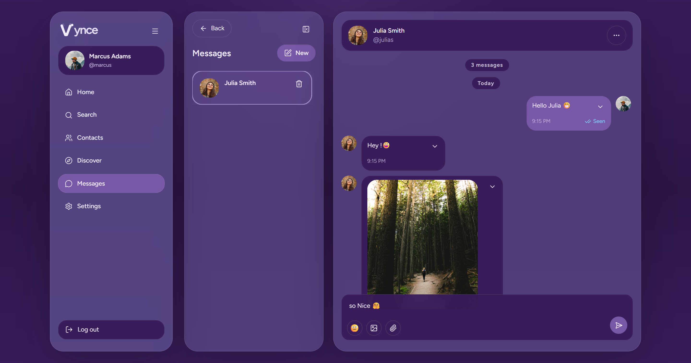
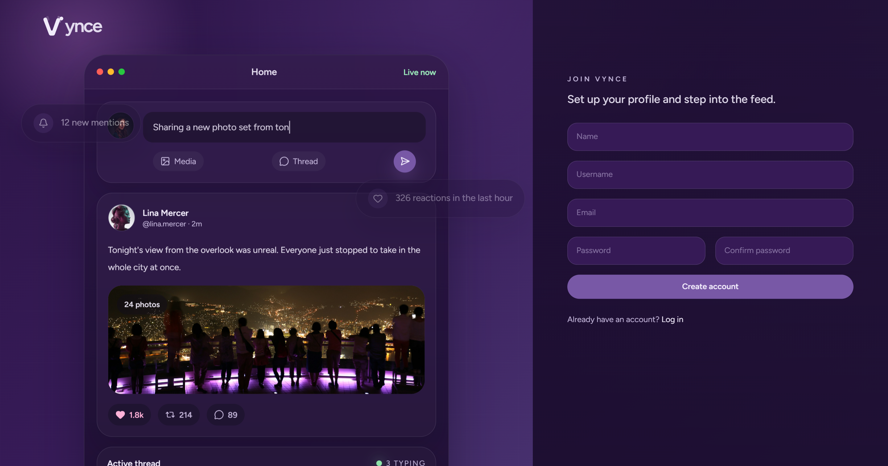

# Vynce

Vynce is a modern social platform built with Laravel and Inertia. It focuses on core community features such as publishing posts, following and connecting with people, direct messaging, notifications, and profile management.

## Overview

The application is designed as a clean, responsive web experience with a React frontend and a Laravel backend. The UI is driven through Inertia, which keeps the app fast and cohesive while preserving a familiar single-page feel.

## Tech Stack

- **Backend:** Laravel 12, PHP 8.4
- **Frontend:** React 18, Inertia.js
- **Styling:** Tailwind CSS, PostCSS
- **Build Tooling:** Vite
- **Auth & Security:** Laravel Breeze, Sanctum
- **Utilities:** Ziggy, Axios, Lucide Icons
- **Code Quality:** Biome, Laravel Pint
- **Testing:** PHPUnit

## Screenshots

### Feed


### Profile


### Messages


### Registration


## Getting Started

### Prerequisites

- PHP 8.4+
- Node.js 18+
- Composer
- pnpm or npm

### Install

```bash
composer install
cp .env.example .env
php artisan key:generate
php artisan migrate
pnpm install
pnpm build
```

### Development

```bash
composer run dev
```

### Tests

```bash
composer test
```
